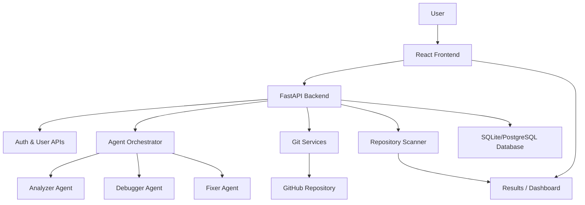

# CI_CD_Healer

## Autonomous CI/CD Healing Agent

CI_CD_Healer is an AI-assisted DevOps platform that automates the detection, diagnosis, and repair of common CI/CD and coding issues in a target repository. The system combines a React-based frontend, a FastAPI backend, an AI-powered multi-agent repair workflow, and Git-based execution to simulate an autonomous software healing pipeline.

This project is designed for hackathon-style demonstration and practical experimentation with agent-driven automation, repository scanning, automated fixing, and result visualization.

---

## 1. Project Overview

### What the system does
- Accepts a GitHub repository URL and team metadata from the user.
- Clones the repository into a local workspace.
- Scans the codebase for common issues such as syntax, import, logic, linting, and indentation problems.
- Uses a multi-agent orchestration flow to analyze failures and generate fixes.
- Commits and pushes fixes to a generated branch.
- Provides a dashboard for monitoring runs, fixes, timelines, and metrics.

### Core objectives
- Reduce manual debugging time.
- Automate repetitive CI/CD failure triage.
- Demonstrate agent-based problem solving in a full-stack environment.
- Provide transparent visibility into the healing process.

---

## 2. System Design

### High-level architecture



### Architectural layers
1. Presentation Layer
   - React + Vite frontend
   - Routing, authentication, dashboard UI, animated visual components

2. Application Layer
   - FastAPI REST API
   - Controllers for orchestrating scan/fix flow
   - Agent orchestration and background task handling

3. Intelligence Layer
   - Analyzer agent parses logs and extracts structured error data
   - Debugger agent classifies bug types and formats outputs
   - Fixer agent invokes the AI model to propose code changes

4. Data & Integration Layer
   - SQLAlchemy models for users, runs, and fixes
   - Git integration for cloning, branching, commit, and push
   - Docker-based execution environment for sandboxing and verification

5. Infrastructure Layer
   - Docker Compose for frontend/backend services
   - Environment-based configuration
   - Local development and container-based deployment support

### End-to-end workflow
1. The user enters repository details on the frontend dashboard.
2. The frontend sends a request to the backend orchestrator endpoint.
3. The backend creates a run entry, clones the repository, and starts the healing workflow.
4. The scanner identifies problems and passes them to the agent pipeline.
5. The fixer agent generates a code patch, the backend commits it, and the repo is updated.
6. The results are stored and displayed in the frontend dashboard.

---

## 3. Frontend Documentation

### Frontend stack
- React 19
- Vite
- React Router
- Zustand for state management
- Tailwind CSS
- Framer Motion for animation
- Recharts / custom dashboard components for visual reporting

### Main frontend responsibilities
- User authentication and protected routes
- Landing and auth pages
- Autonomous dashboard for launching healing runs
- Live progress terminal and run summary UI
- Visual analytics for fixes, timeline, metrics, and agent activity

### Key frontend modules
- [frontend/src/App.jsx](frontend/src/App.jsx) — application router and protected-route setup
- [frontend/src/authStore.js](frontend/src/authStore.js) — JWT-based authentication state
- [frontend/src/pages/AutonomousDashboard.jsx](frontend/src/pages/AutonomousDashboard.jsx) — main orchestration entry UI
- [frontend/src/components](frontend/src/components) — reusable dashboard and chat UI components

### Frontend user flow
- Public pages: landing, login, signup, password reset flow
- Protected app pages: dashboard and profile
- The dashboard collects repository metadata and starts the backend healing process
- Results are shown after the run completes or progresses in real time

### Frontend design highlights
- Responsive UI for desktop and mobile viewing
- Neon, futuristic visual design for the DevOps theme
- Clear separation between public authentication and private app experience

---

## 4. Backend Documentation

### Backend stack
- Python 3.x
- FastAPI
- SQLAlchemy
- Pydantic
- JWT authentication
- Alembic for migrations
- GitPython for repository operations
- Docker-compatible execution model

### Backend responsibilities
- Expose REST APIs for authentication, user management, and agent execution
- Manage database persistence for users, runs, and fixes
- Clone and inspect repositories
- Orchestrate AI agent execution
- Commit and push fixes to the target branch
- Return progress and result data to the frontend

### Main backend modules
- [backend/app/main.py](backend/app/main.py) — FastAPI app initialization and router registration
- [backend/app/routes/auth_routes.py](backend/app/routes/auth_routes.py) — login, OAuth, OTP, password reset APIs
- [backend/app/routes/user_routes.py](backend/app/routes/user_routes.py) — user registration and profile APIs
- [backend/app/routes/agent_routes.py](backend/app/routes/agent_routes.py) — agent orchestration endpoints
- [backend/app/controllers/agent_controller.py](backend/app/controllers/agent_controller.py) — core orchestration logic
- [backend/app/agents/agent_orchestrator.py](backend/app/agents/agent_orchestrator.py) — multi-agent coordination loop
- [backend/app/services](backend/app/services) — repository scanning, Git operations, result generation, and test execution helpers
- [backend/app/db/models.py](backend/app/db/models.py) — database schema for users, runs, and fixes

### Backend request flow
- The user triggers the orchestrator endpoint.
- The controller creates a DB run record.
- The system clones the repository and runs the scanner.
- The orchestrator processes detected failures through analyzer, debugger, and fixer layers.
- Fixes are committed and saved as run results.

### Authentication model
- JWT-based access tokens
- Email/password login
- Google OAuth support
- Password reset through OTP-based flow

---

## 5. Project Structure

```text
backend/
  app/
    agents/
    auth/
    controllers/
    core/
    db/
    routes/
    services/
    utils/
frontend/
  src/
    components/
    pages/
    api/
```

---

## 6. Setup and Installation

### Prerequisites
- Python 3.10+
- Node.js 18+
- Docker and Docker Compose (optional, recommended)
- Git
- A valid Mistral or AI model API key
- A GitHub token for repository operations

### Backend setup
```bash
cd backend
pip install -r requirements.txt
```

Create a `.env` file inside the backend folder:

```env
MISTRAL_API_KEY=your_key_here
GITHUB_TOKEN=your_github_token
DATABASE_URL=sqlite:///./agent.db
SECRET_KEY=your_secret_key
GOOGLE_CLIENT_ID=your_google_client_id
GOOGLE_CLIENT_SECRET=your_google_client_secret
```

Run the backend:
```bash
uvicorn app.main:app --reload
```

### Frontend setup
```bash
cd frontend
npm install
npm run dev
```

### Docker Compose setup
```bash
docker compose up --build
```

This runs:
- Frontend at http://localhost:5173
- Backend at http://localhost:8000

---

## 7. API Overview

### Auth APIs
- POST /api/auth/login
- GET /api/auth/login/google
- POST /api/auth/forgot-password
- POST /api/auth/verify-otp
- POST /api/auth/reset-password

### User APIs
- POST /api/users/
- GET /api/users/me
- GET /api/users/{user_id}
- GET /api/users/
- PUT /api/users/me

### Agent APIs
- GET /api/agent/fix-progress/{run_id}
- POST /api/agent/run-orchestrator

---

## 8. SDLC Lifecycle

### 1. Planning
- Define the project goal: automate CI/CD failure healing.
- Identify major user stories, agent responsibilities, and data flow requirements.

### 2. Requirements Analysis
- Functional requirements:
  - repository input
  - bug scanning
  - AI-based fixing
  - Git branch and commit flow
  - dashboard visualization
- Non-functional requirements:
  - reliability
  - security of tokens
  - maintainability
  - modular architecture

### 3. Design
- System architecture designed around modular agents and service layers.
- Clear separation between frontend UI, backend API, database, and external integrations.

### 4. Development
- Frontend implemented using React and reusable UI components.
- Backend implemented using FastAPI with services, routes, and controllers.
- AI agents and Git services integrated into the workflow.

### 5. Testing
- Unit tests for individual logic modules.
- API tests for endpoints and authentication.
- Integration tests for the agent workflow.
- Manual validation of the dashboard and repair pipeline.

### 6. Deployment
- Containerized deployment with Docker Compose.
- Environment-based configuration for local and hosted setups.

### 7. Maintenance & Evolution
- Extend support for more bug classes.
- Improve AI prompt quality and validation logic.
- Add stronger telemetry, retry optimization, and CI/CD integration.

---

## 9. Testing Strategy

### Unit testing
- Validate utility functions, hashing logic, token generation, and parsing helpers.
- Test scanner logic and rule-based classification independently.

### Integration testing
- Test the full flow from frontend request to backend run creation and fix execution.
- Validate database entries for runs and fixes.

### API testing
- Verify auth routes, user routes, and agent endpoints return the expected responses.
- Confirm authorization and error handling behavior.

### UI testing
- Check routing, loading states, auth redirects, and dashboard rendering.
- Validate form submission and result visualization.

### Manual testing checklist
- Successful login and signup
- Repository submission and run initiation
- Progress tracking for a failed run
- Fix generation and commit creation
- Dashboard rendering of results and metrics

### Suggested future testing improvements
- Add pytest-based backend test suite
- Add frontend component tests with Vitest/React Testing Library
- Introduce CI checks for linting and test execution

---

## 10. Security Considerations

- Store secrets in environment variables instead of hardcoding them.
- Use secure JWT handling and token expiration.
- Avoid exposing sensitive GitHub or API credentials in the client.
- Keep repository operations restricted to trusted sources.

---

## 11. Known Limitations

- Current workflow is optimized primarily for Python-based repositories and common test-driven failures.
- Retry counts and healing loops may need tuning for larger real-world repositories.
- Git push behavior depends on valid credentials and repository permissions.
- Some UI values are still illustrative and can be improved with live backend metrics.

---

## 12. Future Enhancements

- Add a robust test suite and CI pipeline for the project itself.
- Improve AI fix quality with better prompt engineering and validation checkpoints.
- Add support for more languages and frameworks.
- Provide real-time WebSocket progress updates.
- Extend the dashboard with advanced analytics, charts, and run history.

---

## 13. Team / Contribution Notes

This project combines:
- frontend visualization and user experience
- backend orchestration and API services
- AI agent workflow and Git automation
- database persistence and DevOps integration

The modular design makes it easy to extend, test, and deploy independently.

